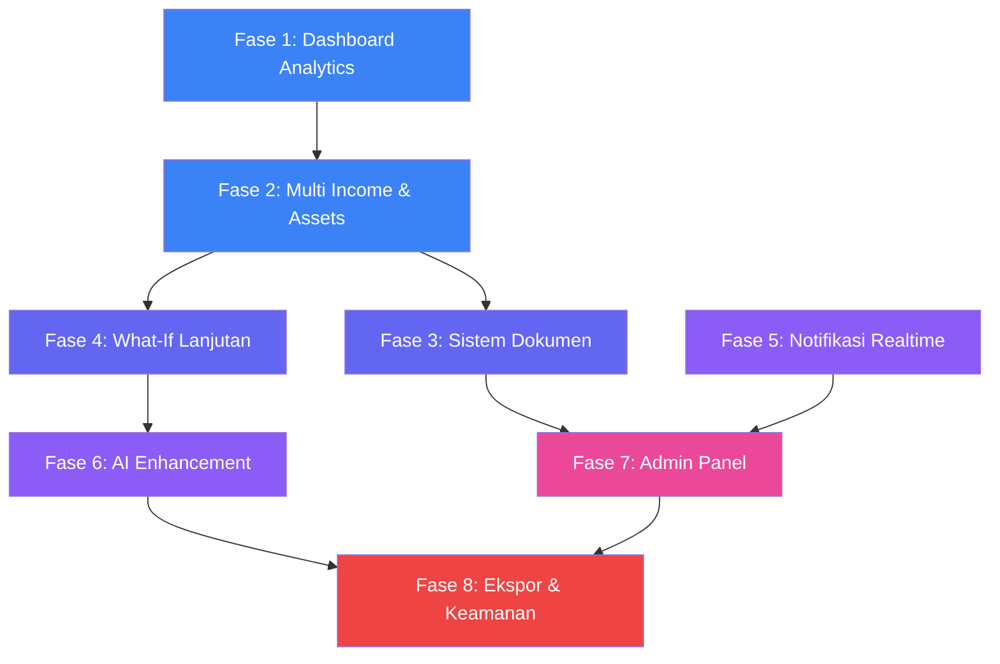

# 📋 Implementation Plan Lanjutan — Tax Feyments App
## Fase Enhancement: Fitur Lanjutan Pasca-MVP

> **Dokumen**: Rencana Implementasi Detail Fitur Lanjutan  
> **Arsitektur**: Clean Architecture (React 19 / Next.js 16 / Tailwind v4 / Supabase / PostgreSQL / Zustand)  
> **Tanggal Penyusunan**: 20 Mei 2026  
> **Versi Aplikasi Saat Ini**: v2.0.26 (MVP Selesai)

---

## 📖 Daftar Isi

1. [Ringkasan Kondisi MVP Saat Ini](#1-ringkasan-kondisi-mvp-saat-ini)
2. [Peta Jalan Fitur Lanjutan](#2-peta-jalan-fitur-lanjutan-roadmap)
3. [Fase 1 — Dashboard Analytics Lanjutan & Grafik Interaktif](#fase-1--dashboard-analytics-lanjutan--grafik-interaktif)
4. [Fase 2 — Multi-Sumber Penghasilan & Manajemen Aset](#fase-2--multi-sumber-penghasilan--manajemen-aset)
5. [Fase 3 — Sistem Dokumen & Lampiran Terstruktur](#fase-3--sistem-dokumen--lampiran-terstruktur)
6. [Fase 4 — Simulasi What-If Lanjutan & Perencanaan Pajak](#fase-4--simulasi-what-if-lanjutan--perencanaan-pajak)
7. [Fase 5 — Notifikasi Real-Time & Reminder Cerdas](#fase-5--notifikasi-real-time--reminder-cerdas)
8. [Fase 6 — AI Taxologist Enhancement & Chat History](#fase-6--ai-taxologist-enhancement--chat-history)
9. [Fase 7 — Admin Panel Fungsional & Audit Trail](#fase-7--admin-panel-fungsional--audit-trail)
10. [Fase 8 — Ekspor Profesional, Integrasi e-Billing & Keamanan](#fase-8--ekspor-profesional-integrasi-e-billing--keamanan)
11. [Ringkasan Perubahan Skema Database Keseluruhan](#ringkasan-perubahan-skema-database-keseluruhan)
12. [Ringkasan Pustaka Tambahan](#ringkasan-pustaka-tambahan)
13. [Urutan Prioritas & Dependensi Pengerjaan](#urutan-prioritas--dependensi-pengerjaan)

---

## 1. Ringkasan Kondisi MVP Saat Ini

### Fitur MVP Yang Telah Selesai

| Komponen | Status | Deskripsi |
|---|---|---|
| **Auth System** | ✅ Selesai | Login/Register via Supabase Auth, session guard |
| **Profil Wajib Pajak** | ✅ Selesai | Form CRUD profil dengan Zod validation, kolom personalisasi AI |
| **Kalkulator Pajak Wizard** | ✅ Selesai | Multi-step wizard PPh Pasal 17 Progresif (Tahunan) & TER PP 58/2023 (Bulanan) |
| **Tax Engine** | ✅ Selesai | `calculateProgressiveTax()`, `calculateMonthlyTerTax()`, TER A/B/C |
| **Dashboard Utama** | ✅ Selesai | Stats cards, history table, trend chart (SVG custom), tax calendar |
| **Riwayat Pelaporan** | ✅ Selesai | Tabel riwayat dengan ekspor PDF via jsPDF |
| **Transaksi Digital** | ✅ Selesai | Pencatatan transaksi, klasifikasi PPh semi-otomatis, mock OCR |
| **Kalender Perpajakan** | ✅ Selesai | Kalender interaktif dengan deadline pajak bulanan/tahunan |
| **AI Taxologist Chat** | ✅ Selesai | Floating chat + halaman dedikasi, Gemini API, konteks profil |
| **Notifikasi** | ✅ Selesai | Reminder otomatis (deadline, profil), bell dropdown, mark as read |
| **Role Guard (RBAC)** | ✅ Selesai | Role user/consultant/admin, RoleGuard component, admin panel (static) |
| **Tren Analisis** | ✅ Selesai | SVG line chart custom tanpa library eksternal |
| **Kamus Pajak & FAQ** | ✅ Selesai | Glossary + FAQ interaktif |
| **Berkas Pendukung** | ✅ Selesai | Halaman manajemen dokumen |

### Arsitektur Database Saat Ini (PostgreSQL / Supabase)

```
┌─────────────────────────┐
│     auth.users          │  ← Tabel bawaan Supabase Auth
│  (id, email, ...)       │
└──────────┬──────────────┘
           │ FK (CASCADE)
           ▼
┌─────────────────────────┐     ┌──────────────────────────┐
│   public.profiles       │     │   public.tax_reports     │
│  id (PK = auth.users)   │◄────│  user_id (FK→profiles)   │
│  full_name              │     │  tax_year, tax_period    │
│  taxpayer_type          │     │  gross_income            │
│  nik, npwp              │     │  tax_payable             │
│  phone_number           │     │  status (draft/submitted │
│  occupation, education  │     │    /paid/overdue)        │
│  marital_status         │     │  created_at, updated_at  │
│  dependents, hobbies    │     └──────────────────────────┘
│  role (user/admin/...)  │
│  created_at, updated_at │     ┌──────────────────────────┐
└─────────────────────────┘     │  public.transactions     │
                                │  user_id (FK→auth.users) │
┌─────────────────────────┐     │  date, amount, category  │
│  public.notifications   │     │  description, tax_type   │
│  user_id (FK)           │     │  created_at              │
│  title, message         │     └──────────────────────────┘
│  is_read, created_at    │
└─────────────────────────┘
```

### Teknologi Stack Aktif

- **Framework**: Next.js 16.2.6 (App Router, React 19)
- **Styling**: Tailwind CSS v4
- **Backend**: Supabase (Auth, Database, Storage)
- **State**: Zustand v5
- **Forms**: React Hook Form v7 + Zod v4
- **Data Fetching**: TanStack React Query v5
- **AI**: Google Generative AI (Gemini)
- **PDF**: jsPDF v4
- **Markdown**: react-markdown v10

---

## 2. Peta Jalan Fitur Lanjutan (Roadmap)

```
┌──────────────────────────────────────────────────────────────────────────────┐
│                        FASE ENHANCEMENT ROADMAP                            │
├──────────────────────────────────────────────────────────────────────────────┤
│                                                                              │
│  ┌─── Sprint 1 (Minggu 1-2) ──────────────────────────────────────────┐    │
│  │  Fase 1: Dashboard Analytics + Library Grafik Profesional          │    │
│  │  Fase 2: Multi-Sumber Penghasilan & Manajemen Aset                 │    │
│  └────────────────────────────────────────────────────────────────────┘    │
│                              │                                              │
│  ┌─── Sprint 2 (Minggu 3-4) ──────────────────────────────────────────┐    │
│  │  Fase 3: Sistem Dokumen & Lampiran (Supabase Storage)              │    │
│  │  Fase 4: What-If Lanjutan & Tax Planning Advisor                   │    │
│  └────────────────────────────────────────────────────────────────────┘    │
│                              │                                              │
│  ┌─── Sprint 3 (Minggu 5-6) ──────────────────────────────────────────┐    │
│  │  Fase 5: Notifikasi Real-Time (Supabase Realtime Channels)         │    │
│  │  Fase 6: AI Chat History Persist & Enhancement                     │    │
│  └────────────────────────────────────────────────────────────────────┘    │
│                              │                                              │
│  ┌─── Sprint 4 (Minggu 7-8) ──────────────────────────────────────────┐    │
│  │  Fase 7: Admin Panel Fungsional & Audit Trail                      │    │
│  │  Fase 8: Ekspor Profesional, e-Billing & Keamanan                  │    │
│  └────────────────────────────────────────────────────────────────────┘    │
│                                                                              │
└──────────────────────────────────────────────────────────────────────────────┘
```

---

## Fase 1 — Dashboard Analytics Lanjutan & Grafik Interaktif

### 🎯 Tujuan
Mengganti visualisasi SVG custom yang ada (`TaxTrendChart.tsx`) dengan library grafik profesional, serta menambahkan widget analitik lanjutan: rasio pajak efektif, breakdown per kategori (pie/donut chart), dan perbandingan year-over-year.

### 📦 Kebutuhan Teknis & Pustaka Tambahan

| Pustaka | Versi | Kegunaan |
|---|---|---|
| `recharts` | ^2.x | Library grafik React (Line, Bar, Pie, Area, Radar charts) |
| `date-fns` | ^4.x | Utilitas manipulasi tanggal untuk agregasi data per bulan/kuartal |

### 🧱 Langkah-Langkah Terstruktur (Brick-by-Brick)

#### Langkah 1.1 — Instalasi Library Grafik
```bash
npm install recharts date-fns
```

#### Langkah 1.2 — Buat Komponen Grafik Baru
Buat file-file baru di `src/components/charts/`:

| File | Deskripsi |
|---|---|
| `IncomeVsTaxChart.tsx` | Area/Line chart perbandingan bruto vs pajak terutang per bulan/tahun |
| `TaxBreakdownPieChart.tsx` | Donut chart breakdown pajak per kategori transaksi (PPh 21, PPh 23, PPh Final, dll.) |
| `MonthlyTrendBarChart.tsx` | Bar chart tren penghasilan bruto bulanan |
| `EffectiveRateGauge.tsx` | Gauge/radial chart menampilkan tarif efektif rata-rata pajak pengguna |
| `YearComparisonChart.tsx` | Grouped bar chart perbandingan YoY (year-over-year) |

#### Langkah 1.3 — Buat Utilitas Agregasi Data
Buat file `src/lib/analyticsEngine.ts`:

```typescript
// Fungsi agregasi data untuk grafik
export function aggregateByMonth(reports: TaxReportData[]): MonthlyAggregate[] { ... }
export function aggregateByYear(reports: TaxReportData[]): YearlyAggregate[] { ... }
export function calculateEffectiveRate(grossIncome: number, taxPayable: number): number { ... }
export function breakdownByCategory(transactions: Transaction[]): CategoryBreakdown[] { ... }
export function compareYearOverYear(currentYear: YearlyAggregate, prevYear: YearlyAggregate): YoYComparison { ... }
```

#### Langkah 1.4 — Buat Halaman Analytics Terpisah
- Buat route baru: `src/app/dashboard/analytics/page.tsx`
- Tambahkan menu navigasi "Analitik" di sidebar (`dashboard/layout.tsx`)
- Halaman ini menampilkan grid responsif dari seluruh chart baru

#### Langkah 1.5 — Refaktor TaxTrendChart
- Ganti implementasi SVG manual di `TaxTrendChart.tsx` menjadi Recharts `<ResponsiveContainer>` + `<AreaChart>`
- Pertahankan desain glassmorphism dan warna biru/rose yang sudah ada
- Tambahkan tooltip interaktif Recharts dengan custom styling sesuai design system

#### Langkah 1.6 — Integrasi Widget ke Dashboard Utama
- Tambahkan kartu ringkasan "Tarif Efektif" di `DashboardStats.tsx` (kartu ke-4)
- Tambahkan mini donut chart breakdown di sebelah stats card

### ✅ Kriteria Kesuksesan (Definition of Done)

- [ ] Library `recharts` dan `date-fns` terinstall tanpa konflik dependensi
- [ ] Minimal 3 jenis grafik baru berfungsi dan responsif di halaman Analytics
- [ ] `TaxTrendChart.tsx` berhasil direfaktor ke Recharts tanpa regresi visual
- [ ] Custom tooltip Recharts menggunakan design system slate/blue yang konsisten
- [ ] Grafik menampilkan data real dari Supabase, bukan data dummy, ketika data tersedia
- [ ] Halaman Analytics terakses via sidebar dan loading state tertangani dengan baik
- [ ] Performa render chart < 300ms pada dataset 100+ records

---

## Fase 2 — Multi-Sumber Penghasilan & Manajemen Aset

### 🎯 Tujuan
Memungkinkan pengguna mencatat penghasilan dari berbagai sumber (pekerjaan utama, freelance, sewa, investasi) dan mengelola daftar aset/harta untuk keperluan pelaporan SPT Tahunan.

### 🗄️ Perubahan Skema Database

#### Tabel Baru: `public.income_sources`
```sql
CREATE TABLE public.income_sources (
    id UUID PRIMARY KEY DEFAULT gen_random_uuid(),
    user_id UUID NOT NULL REFERENCES auth.users(id) ON DELETE CASCADE,
    source_name TEXT NOT NULL,                       -- Nama sumber: 'PT ABC', 'Freelance Design', dll
    source_type TEXT NOT NULL CHECK (source_type IN (
        'pekerjaan_tetap',        -- Gaji dari pemberi kerja utama
        'pekerjaan_bebas',        -- Freelance / konsultan independen
        'usaha',                  -- UMKM / wirausaha
        'sewa',                   -- Sewa tanah/bangunan
        'investasi',              -- Dividen, bunga, capital gain
        'lainnya'                 -- Pendapatan lain-lain
    )),
    annual_income NUMERIC(15,2) NOT NULL DEFAULT 0 CHECK (annual_income >= 0),
    tax_year INT NOT NULL,
    npwp_pemotong VARCHAR(16),                       -- NPWP pemberi kerja/pemotong (opsional)
    is_tax_withheld BOOLEAN DEFAULT false,           -- Apakah PPh sudah dipotong oleh pihak lain?
    withheld_amount NUMERIC(15,2) DEFAULT 0,         -- Jumlah PPh yang sudah dipotong
    notes TEXT,
    created_at TIMESTAMPTZ DEFAULT NOW() NOT NULL,
    updated_at TIMESTAMPTZ DEFAULT NOW() NOT NULL
);

-- RLS
ALTER TABLE public.income_sources ENABLE ROW LEVEL SECURITY;
CREATE POLICY "User own income_sources SELECT" ON public.income_sources FOR SELECT USING (auth.uid() = user_id);
CREATE POLICY "User own income_sources INSERT" ON public.income_sources FOR INSERT WITH CHECK (auth.uid() = user_id);
CREATE POLICY "User own income_sources UPDATE" ON public.income_sources FOR UPDATE USING (auth.uid() = user_id);
CREATE POLICY "User own income_sources DELETE" ON public.income_sources FOR DELETE USING (auth.uid() = user_id);
```

#### Tabel Baru: `public.assets`
```sql
CREATE TABLE public.assets (
    id UUID PRIMARY KEY DEFAULT gen_random_uuid(),
    user_id UUID NOT NULL REFERENCES auth.users(id) ON DELETE CASCADE,
    asset_name TEXT NOT NULL,                         -- Nama aset: 'Rumah Jl. Merdeka', 'Mobil Honda HRV'
    asset_type TEXT NOT NULL CHECK (asset_type IN (
        'tanah_bangunan',         -- Properti / real estate
        'kendaraan',              -- Mobil, motor
        'deposito_tabungan',      -- Simpanan bank
        'saham_obligasi',         -- Efek / surat berharga
        'piutang',                -- Piutang / receivable
        'perhiasan',              -- Emas, berlian, logam mulia
        'peralatan',              -- Elektronik, furniture bernilai
        'lainnya'                 -- Aset lain-lain
    )),
    acquisition_year INT NOT NULL,                    -- Tahun perolehan
    acquisition_value NUMERIC(15,2) NOT NULL CHECK (acquisition_value >= 0),
    current_value NUMERIC(15,2) DEFAULT 0,            -- Estimasi nilai wajar saat ini
    description TEXT,
    tax_year INT NOT NULL,                            -- Tahun pajak pelaporan
    created_at TIMESTAMPTZ DEFAULT NOW() NOT NULL,
    updated_at TIMESTAMPTZ DEFAULT NOW() NOT NULL
);

-- RLS
ALTER TABLE public.assets ENABLE ROW LEVEL SECURITY;
CREATE POLICY "User own assets SELECT" ON public.assets FOR SELECT USING (auth.uid() = user_id);
CREATE POLICY "User own assets INSERT" ON public.assets FOR INSERT WITH CHECK (auth.uid() = user_id);
CREATE POLICY "User own assets UPDATE" ON public.assets FOR UPDATE USING (auth.uid() = user_id);
CREATE POLICY "User own assets DELETE" ON public.assets FOR DELETE USING (auth.uid() = user_id);
```

### 🧱 Langkah-Langkah Terstruktur

#### Langkah 2.1 — Migrasi Database
- Jalankan skrip SQL pembuatan tabel `income_sources` dan `assets` di Supabase SQL Editor
- Pasang trigger `update_modified_column()` pada kedua tabel baru

#### Langkah 2.2 — Definisi Types & Validation Schema
Buat/perbarui file `src/types/taxpayer.ts`:
```typescript
export const incomeSourceSchema = z.object({
  sourceName: z.string().min(2),
  sourceType: z.enum(['pekerjaan_tetap','pekerjaan_bebas','usaha','sewa','investasi','lainnya']),
  annualIncome: z.number().min(0),
  taxYear: z.number().int().min(2020),
  npwpPemotong: z.string().optional(),
  isTaxWithheld: z.boolean().default(false),
  withheldAmount: z.number().min(0).default(0),
  notes: z.string().optional(),
});

export const assetSchema = z.object({
  assetName: z.string().min(2),
  assetType: z.enum(['tanah_bangunan','kendaraan','deposito_tabungan','saham_obligasi','piutang','perhiasan','peralatan','lainnya']),
  acquisitionYear: z.number().int().min(1950),
  acquisitionValue: z.number().min(0),
  currentValue: z.number().min(0).optional(),
  description: z.string().optional(),
  taxYear: z.number().int().min(2020),
});
```

#### Langkah 2.3 — Buat Custom Hooks
- `src/hooks/useIncomeSources.ts` — CRUD hooks untuk income_sources (useFetch, useMutate, useDelete)
- `src/hooks/useAssets.ts` — CRUD hooks untuk assets

#### Langkah 2.4 — Buat Komponen UI
- `src/components/IncomeSourceForm.tsx` — Form tambah/edit sumber penghasilan dengan auto-compute total
- `src/components/IncomeSourceTable.tsx` — Tabel daftar sumber penghasilan per tahun pajak
- `src/components/AssetForm.tsx` — Form tambah/edit aset harta
- `src/components/AssetTable.tsx` — Tabel daftar aset dengan total nilai

#### Langkah 2.5 — Buat Halaman Khusus
- `src/app/dashboard/income/page.tsx` — Halaman pengelolaan multi-sumber penghasilan
- `src/app/dashboard/assets/page.tsx` — Halaman pengelolaan aset/harta kekayaan
- Tambahkan kedua menu ke sidebar navigation di `layout.tsx`

#### Langkah 2.6 — Integrasi dengan Tax Engine
- Update `src/lib/taxEngine.ts`: Tambahkan fungsi `calculateConsolidatedTax()` yang menerima array `IncomeSource[]` dan menghitung total PKP dari seluruh sumber dikurangi PPh yang sudah dipotong (kredit pajak)
- Tampilkan ringkasan "Total Penghasilan Gabungan" dan "Total Kredit Pajak" di dashboard

### ✅ Kriteria Kesuksesan

- [ ] Tabel `income_sources` dan `assets` terbuat di Supabase dengan RLS aktif
- [ ] User dapat CRUD minimal 3 sumber penghasilan berbeda dalam 1 tahun pajak
- [ ] User dapat CRUD daftar aset dengan total nilai teragregasi otomatis
- [ ] Form validation berjalan via Zod tanpa error untuk semua tipe sumber/aset
- [ ] Kalkulasi pajak gabungan (consolidated) akurat sesuai UU HPP
- [ ] Data kredit pajak (PPh sudah dipotong) terkurangkan dari total pajak terutang
- [ ] Navigasi sidebar ke halaman Income & Assets berfungsi tanpa broken route

---

## Fase 3 — Sistem Dokumen & Lampiran Terstruktur

### 🎯 Tujuan
Mengubah halaman Berkas Pendukung (`/dashboard/documents`) dari tampilan statis menjadi sistem manajemen dokumen fungsional yang terintegrasi dengan **Supabase Storage** untuk upload, preview, dan pengelompokan dokumen bukti perpajakan.

### 🗄️ Perubahan Skema Database

#### Tabel Baru: `public.documents`
```sql
CREATE TABLE public.documents (
    id UUID PRIMARY KEY DEFAULT gen_random_uuid(),
    user_id UUID NOT NULL REFERENCES auth.users(id) ON DELETE CASCADE,
    file_name TEXT NOT NULL,                          -- Nama asli file yang di-upload
    file_path TEXT NOT NULL,                          -- Path di Supabase Storage bucket
    file_size BIGINT NOT NULL DEFAULT 0,              -- Ukuran file dalam bytes
    file_type TEXT NOT NULL,                          -- MIME type: 'application/pdf', 'image/jpeg'
    category TEXT NOT NULL CHECK (category IN (
        'bukti_potong',           -- Bukti potong 1721-A1 / A2
        'faktur_pajak',           -- Faktur pajak PPN
        'spt_tahunan',            -- Salinan SPT yang sudah dilaporkan
        'nota_transaksi',         -- Nota / invoice / kuitansi
        'surat_keterangan',       -- Surat keterangan fiskal, domisili, dll
        'identitas',              -- KTP, NPWP, SKT
        'lainnya'
    )),
    tax_year INT,                                     -- Tahun pajak terkait (opsional)
    description TEXT,
    is_verified BOOLEAN DEFAULT false,                -- Status verifikasi admin
    created_at TIMESTAMPTZ DEFAULT NOW() NOT NULL
);

-- RLS
ALTER TABLE public.documents ENABLE ROW LEVEL SECURITY;
CREATE POLICY "User own documents SELECT" ON public.documents FOR SELECT USING (auth.uid() = user_id);
CREATE POLICY "User own documents INSERT" ON public.documents FOR INSERT WITH CHECK (auth.uid() = user_id);
CREATE POLICY "User own documents DELETE" ON public.documents FOR DELETE USING (auth.uid() = user_id);

-- Admin juga bisa melihat semua dokumen untuk verifikasi
CREATE POLICY "Admin can view all documents" ON public.documents FOR SELECT
USING (
    EXISTS (SELECT 1 FROM public.profiles WHERE id = auth.uid() AND role = 'admin')
);
```

### Konfigurasi Supabase Storage

```
Bucket Name: "tax-documents"
├── Public: false (private bucket)
├── Max File Size: 10 MB
├── Allowed MIME Types: image/jpeg, image/png, application/pdf
└── RLS Policy: hanya user pemilik yang bisa read/write file mereka
```

### 🧱 Langkah-Langkah Terstruktur

#### Langkah 3.1 — Konfigurasi Supabase Storage
- Buat bucket `tax-documents` di Supabase Storage Dashboard (private)
- Atur RLS policy bucket: user hanya akses folder `{user_id}/`
- Batas upload: 10 MB per file, format PDF, JPEG, PNG

#### Langkah 3.2 — Migrasi Tabel `documents`
- Jalankan skrip DDL `public.documents` di SQL Editor

#### Langkah 3.3 — Buat Upload Hook & Utilities
- `src/hooks/useDocuments.ts`:
  - `useUploadDocument()` — Upload file ke Storage + insert metadata ke tabel
  - `useFetchDocuments()` — Fetch daftar dokumen user, filter by category/year
  - `useDeleteDocument()` — Hapus file dari Storage + delete row dari tabel
  - `useDocumentUrl()` — Generate signed URL untuk preview/download

#### Langkah 3.4 — Buat Komponen UI
- `src/components/documents/DocumentUploader.tsx` — Drag & drop zone + file input, preview thumbnail
- `src/components/documents/DocumentCard.tsx` — Kartu dokumen dengan thumbnail, metadata, download button
- `src/components/documents/DocumentFilter.tsx` — Filter bar berdasarkan kategori, tahun pajak, status

#### Langkah 3.5 — Refaktor Halaman Documents
- Overhaul `src/app/dashboard/documents/page.tsx` dari halaman statis menjadi fungsional
- Grid/list view toggle untuk tampilan dokumen
- Preview modal untuk file gambar dan PDF (menggunakan `<iframe>` atau `` untuk preview)

#### Langkah 3.6 — Integrasi Admin Verifikasi
- Di admin panel, tambahkan tab "Verifikasi Dokumen" yang menampilkan semua dokumen pending
- Admin dapat menandai dokumen sebagai `is_verified = true`

### ✅ Kriteria Kesuksesan

- [ ] Bucket `tax-documents` terkonfigurasi dengan benar di Supabase Storage
- [ ] Upload file PDF/gambar berhasil tersimpan di Storage dan metadata tercatat di tabel `documents`
- [ ] File maks 10 MB, format diluar whitelist ditolak dengan pesan error yang jelas
- [ ] User dapat melihat daftar dokumennya sendiri, difilter berdasarkan kategori dan tahun
- [ ] Preview file gambar dan PDF berfungsi dalam modal
- [ ] Hapus dokumen menghilangkan file dari Storage DAN row dari database
- [ ] Admin dapat melihat dan memverifikasi dokumen seluruh user

---

## Fase 4 — Simulasi What-If Lanjutan & Perencanaan Pajak

### 🎯 Tujuan
Mengupgrade halaman What-If Simulator (`/dashboard/what-if`) dengan kemampuan simulasi multi-skenario: membandingkan dampak pajak jika user menambah penghasilan baru, mengubah status PTKP, pindah ke skema UMKM, atau mengoptimasi investasi untuk tax saving.

### 🗄️ Perubahan Skema Database

#### Tabel Baru: `public.what_if_scenarios`
```sql
CREATE TABLE public.what_if_scenarios (
    id UUID PRIMARY KEY DEFAULT gen_random_uuid(),
    user_id UUID NOT NULL REFERENCES auth.users(id) ON DELETE CASCADE,
    scenario_name TEXT NOT NULL,                      -- Nama skenario: 'Kalau Nikah 2027'
    base_gross_income NUMERIC(15,2) NOT NULL DEFAULT 0,
    base_ptkp_status TEXT NOT NULL DEFAULT 'TK/0',
    base_tax_result NUMERIC(15,2) DEFAULT 0,

    -- Variabel simulasi
    sim_gross_income NUMERIC(15,2),                   -- Penghasilan bruto simulasi
    sim_ptkp_status TEXT,                             -- Status PTKP simulasi
    sim_additional_income NUMERIC(15,2) DEFAULT 0,    -- Penghasilan tambahan
    sim_additional_deductions NUMERIC(15,2) DEFAULT 0,-- Pengurang tambahan (donasi, zakat, dll)
    sim_umkm_mode BOOLEAN DEFAULT false,              -- Toggle skema UMKM PP 23
    sim_umkm_omzet NUMERIC(15,2) DEFAULT 0,
    sim_tax_result NUMERIC(15,2) DEFAULT 0,

    -- Perbandingan
    tax_difference NUMERIC(15,2) DEFAULT 0,           -- Selisih: base - sim
    savings_percentage NUMERIC(5,2) DEFAULT 0,

    notes TEXT,
    created_at TIMESTAMPTZ DEFAULT NOW() NOT NULL
);

-- RLS
ALTER TABLE public.what_if_scenarios ENABLE ROW LEVEL SECURITY;
CREATE POLICY "User own scenarios SELECT" ON public.what_if_scenarios FOR SELECT USING (auth.uid() = user_id);
CREATE POLICY "User own scenarios INSERT" ON public.what_if_scenarios FOR INSERT WITH CHECK (auth.uid() = user_id);
CREATE POLICY "User own scenarios UPDATE" ON public.what_if_scenarios FOR UPDATE USING (auth.uid() = user_id);
CREATE POLICY "User own scenarios DELETE" ON public.what_if_scenarios FOR DELETE USING (auth.uid() = user_id);
```

### 🧱 Langkah-Langkah Terstruktur

#### Langkah 4.1 — Perbarui Tax Engine
- Tambahkan fungsi di `src/lib/taxEngine.ts`:

```typescript
// Kalkulasi PPh UMKM PP 23 (Final 0.5%) dengan threshold Rp 500 juta
export function calculateUmkmTax(annualOmzet: number): number { ... }

// Kalkulasi pengurang tambahan (zakat, donasi s/d 5% dari bruto)
export function calculateAdditionalDeductions(bruto: number, deductions: number): number { ... }

// Bandingkan 2 skenario dan return selisih + persentase hemat
export function compareScenarios(baseTax: number, simTax: number): { diff: number; pct: number } { ... }
```

#### Langkah 4.2 — Buat Komponen Simulator Interaktif
- `src/components/whatif/ScenarioBuilder.tsx` — Form builder multi-step untuk skenario baru
- `src/components/whatif/ScenarioComparisonCard.tsx` — Side-by-side comparison card (base vs simulasi)
- `src/components/whatif/TaxSavingsSummary.tsx` — Ringkasan penghematan dengan visual gauge

#### Langkah 4.3 — Buat Hooks
- `src/hooks/useWhatIfScenarios.ts` — CRUD + auto-calculate hooks

#### Langkah 4.4 — Refaktor Halaman What-If
- Overhaul `src/app/dashboard/what-if/page.tsx`:
  - Panel kiri: Form builder skenario
  - Panel kanan: Hasil perbandingan real-time (live computation tanpa save)
  - Tombol "Simpan Skenario" untuk persistensi
  - Daftar skenario tersimpan di bawah dengan opsi load/delete

#### Langkah 4.5 — Integrasi AI Tax Advisor
- Setelah skenario dihitung, tawarkan tombol "Tanya AI Taxologist"
- Otomatis kirim konteks skenario ke endpoint `/api/chat` untuk mendapatkan saran optimasi pajak

### ✅ Kriteria Kesuksesan

- [ ] Tabel `what_if_scenarios` terbuat dengan RLS aktif
- [ ] User dapat membuat minimal 5 skenario berbeda dan menyimpannya ke database
- [ ] Kalkulasi UMKM PP 23 (0.5%) dan threshold Rp 500 Juta berfungsi akurat
- [ ] Perbandingan side-by-side menampilkan selisih pajak dan persentase penghematan
- [ ] Komputasi berjalan real-time saat slider/input berubah (tanpa perlu klik submit)
- [ ] Integrasi AI Taxologist memberikan saran personalisasi berdasarkan skenario
- [ ] Skenario tersimpan dapat di-load kembali dan diedit

---

## Fase 5 — Notifikasi Real-Time & Reminder Cerdas

### 🎯 Tujuan
Mengupgrade sistem notifikasi dari polling interval (setiap 10 detik) menjadi **Supabase Realtime** menggunakan Postgres Changes listener. Menambahkan notifikasi push browser (Web Push API) dan reminder cerdas berdasarkan pola perilaku pengguna.

### 🗄️ Perubahan Skema Database

#### Modifikasi Tabel: `public.notifications`
```sql
-- Tambah kolom baru ke tabel notifications yang sudah ada
ALTER TABLE public.notifications ADD COLUMN IF NOT EXISTS
    notification_type TEXT DEFAULT 'system' CHECK (notification_type IN (
        'system',           -- Notifikasi sistem umum
        'deadline',         -- Pengingat jatuh tempo
        'status_change',    -- Perubahan status laporan (draft → submitted → paid)
        'document',         -- Notifikasi terkait dokumen (verified, rejected)
        'ai_insight',       -- Insight/saran dari AI Taxologist
        'achievement'       -- Gamifikasi: badge/pencapaian
    ));

ALTER TABLE public.notifications ADD COLUMN IF NOT EXISTS
    priority TEXT DEFAULT 'normal' CHECK (priority IN ('low', 'normal', 'high', 'urgent'));

ALTER TABLE public.notifications ADD COLUMN IF NOT EXISTS
    action_url TEXT;  -- Deep link ke halaman terkait (misal: '/dashboard/documents')

ALTER TABLE public.notifications ADD COLUMN IF NOT EXISTS
    metadata JSONB DEFAULT '{}';  -- Data tambahan fleksibel
```

#### Tabel Baru: `public.notification_preferences`
```sql
CREATE TABLE public.notification_preferences (
    id UUID PRIMARY KEY DEFAULT gen_random_uuid(),
    user_id UUID NOT NULL REFERENCES auth.users(id) ON DELETE CASCADE UNIQUE,
    email_notifications BOOLEAN DEFAULT true,
    push_notifications BOOLEAN DEFAULT true,
    deadline_reminder_days INT DEFAULT 3,             -- Ingatkan X hari sebelum deadline
    quiet_hours_start TIME DEFAULT '22:00',
    quiet_hours_end TIME DEFAULT '07:00',
    created_at TIMESTAMPTZ DEFAULT NOW() NOT NULL,
    updated_at TIMESTAMPTZ DEFAULT NOW() NOT NULL
);

-- RLS
ALTER TABLE public.notification_preferences ENABLE ROW LEVEL SECURITY;
CREATE POLICY "User own prefs" ON public.notification_preferences FOR ALL USING (auth.uid() = user_id);
```

### 🧱 Langkah-Langkah Terstruktur

#### Langkah 5.1 — Aktifkan Supabase Realtime
- Enable Realtime pada tabel `notifications` di Supabase Dashboard
- Konfigurasi Realtime publication untuk event `INSERT` pada tabel `notifications`

#### Langkah 5.2 — Refaktor NotificationCenter
- Ganti `refetchInterval: 10000` di `useNotifications.ts` dengan Supabase Realtime subscription:

```typescript
// Contoh pola subscription
const channel = supabase.channel('user-notifications')
  .on('postgres_changes', {
    event: 'INSERT',
    schema: 'public',
    table: 'notifications',
    filter: `user_id=eq.${userId}`,
  }, (payload) => {
    // Tambahkan notifikasi baru ke cache React Query
    queryClient.setQueryData(['notifications_list'], (old) => [payload.new, ...old]);
  })
  .subscribe();
```

#### Langkah 5.3 — Implementasi Web Push Notifications
- Daftarkan Service Worker (`public/sw.js`) untuk Web Push API
- Minta izin push notification saat user pertama kali login
- Kirim push notification saat notifikasi `priority: 'urgent'` masuk

#### Langkah 5.4 — Buat Smart Reminder Engine
- Buat `src/lib/reminderEngine.ts`:
  - Deteksi deadline yang mendekat berdasarkan `notification_preferences.deadline_reminder_days`
  - Kirim reminder otomatis jika user punya laporan berstatus `draft` lebih dari 7 hari
  - Kirim notifikasi `ai_insight` jika ada anomali (misal: penghasilan bulan ini naik >30%)

#### Langkah 5.5 — Buat Halaman Pengaturan Notifikasi
- `src/app/dashboard/profile/notifications/page.tsx` atau tab baru di halaman profil
- Toggle preferensi: email, push, quiet hours, reminder days

#### Langkah 5.6 — Upgrade UI NotificationCenter
- Tambahkan ikon kategori yang berbeda per `notification_type` (🔔 system, ⏰ deadline, 📄 document, 🤖 ai_insight)
- Tambahkan badge prioritas (warna merah untuk urgent, kuning untuk high)
- Tambahkan deep-link: klik notifikasi → navigasi ke `action_url`

### ✅ Kriteria Kesuksesan

- [ ] Supabase Realtime subscription berjalan — notifikasi baru muncul instan tanpa refresh
- [ ] Polling 10-detik (`refetchInterval`) berhasil dihapus tanpa regresi
- [ ] Web Push Notification muncul di browser saat notifikasi `urgent` masuk (jika user mengizinkan)
- [ ] Preferensi notifikasi (quiet hours, reminder days) tersimpan dan dihormati oleh engine
- [ ] Minimal 4 ikon kategori notifikasi tampil dengan warna/ikon berbeda
- [ ] Deep-link dari notifikasi ke halaman terkait berfungsi
- [ ] Smart reminder mendeteksi dan mengirim notifikasi untuk draft terlalu lama (>7 hari)

---

## Fase 6 — AI Taxologist Enhancement & Chat History

### 🎯 Tujuan
Meningkatkan kemampuan AI Taxologist dengan persistensi riwayat percakapan, konteks multi-source (profil + transaksi + laporan), prompt engineering lanjutan, dan fitur "Suggested Questions".

### 🗄️ Perubahan Skema Database

#### Tabel Baru: `public.chat_sessions`
```sql
CREATE TABLE public.chat_sessions (
    id UUID PRIMARY KEY DEFAULT gen_random_uuid(),
    user_id UUID NOT NULL REFERENCES auth.users(id) ON DELETE CASCADE,
    title TEXT DEFAULT 'Percakapan Baru',
    is_active BOOLEAN DEFAULT true,
    created_at TIMESTAMPTZ DEFAULT NOW() NOT NULL,
    updated_at TIMESTAMPTZ DEFAULT NOW() NOT NULL
);

-- RLS
ALTER TABLE public.chat_sessions ENABLE ROW LEVEL SECURITY;
CREATE POLICY "User own sessions" ON public.chat_sessions FOR ALL USING (auth.uid() = user_id);
```

#### Tabel Baru: `public.chat_messages`
```sql
CREATE TABLE public.chat_messages (
    id UUID PRIMARY KEY DEFAULT gen_random_uuid(),
    session_id UUID NOT NULL REFERENCES public.chat_sessions(id) ON DELETE CASCADE,
    role TEXT NOT NULL CHECK (role IN ('user', 'ai', 'system')),
    content TEXT NOT NULL,
    metadata JSONB DEFAULT '{}',                      -- Token count, model info, confidence
    created_at TIMESTAMPTZ DEFAULT NOW() NOT NULL
);

-- RLS (inherit akses via session ownership)
ALTER TABLE public.chat_messages ENABLE ROW LEVEL SECURITY;
CREATE POLICY "User own messages via session" ON public.chat_messages FOR ALL USING (
    EXISTS (SELECT 1 FROM public.chat_sessions WHERE id = session_id AND user_id = auth.uid())
);

-- Index untuk performa query riwayat
CREATE INDEX idx_chat_messages_session ON public.chat_messages(session_id, created_at);
```

### 🧱 Langkah-Langkah Terstruktur

#### Langkah 6.1 — Migrasi Tabel Chat
- Jalankan skrip DDL `chat_sessions` dan `chat_messages`
- Buat index untuk optimasi query

#### Langkah 6.2 — Upgrade API Route `/api/chat`
- Modifikasi `src/app/api/chat/route.ts`:
  - Terima `sessionId` (opsional) di request body
  - Jika `sessionId` ada, load riwayat pesan dari `chat_messages` sebagai konteks
  - Kirim riwayat 10 pesan terakhir ke Gemini sebagai `history`
  - Simpan pesan user dan respons AI ke `chat_messages`
  - Auto-generate judul sesi dari pesan pertama (via AI summarization)

#### Langkah 6.3 — Enriched Context Injection
- Perbarui system prompt Gemini agar menerima konteks lanjutan:
```
Konteks User:
- Profil: {fullName}, {taxpayerType}, {occupation}, {maritalStatus}, {dependents}
- Total Penghasilan Tahun Ini: Rp {totalIncome}
- Total Pajak Terutang: Rp {totalTax}
- Sumber Penghasilan: [{sources}]
- Transaksi Terakhir: [{recentTransactions}]
- Status Laporan: {draftCount} draft, {submittedCount} submitted
```

#### Langkah 6.4 — Buat Komponen Sidebar Chat History
- `src/components/chat/ChatSessionSidebar.tsx` — Daftar sesi chat dengan judul, tanggal, opsi delete
- `src/components/chat/SuggestedQuestions.tsx` — Kartu pertanyaan populer (berdasarkan konteks user)
  - Contoh: "Bagaimana cara menghemat pajak dengan status K/2?"
  - "Apa perbedaan PPh Final UMKM dan PPh Progresif?"
  - "Bisakah saya mendapat pembebasan pajak untuk UMKM?"

#### Langkah 6.5 — Upgrade Halaman AI Assistant
- Refaktor `src/app/dashboard/assistant/page.tsx`:
  - Layout 2 kolom: sidebar sesi (kiri) + chat area (kanan)
  - Tombol "Percakapan Baru" membuat `chat_sessions` baru
  - Klik sesi lama → load pesan dari `chat_messages`
  - Suggested questions muncul saat sesi baru (belum ada pesan)

#### Langkah 6.6 — Upgrade Floating Chat Widget
- Update `src/components/TaxAssistantChat.tsx`:
  - Simpan pesan ke sesi aktif (atau buat sesi baru otomatis)
  - Tampilkan tombol "Lihat Riwayat Penuh" → navigasi ke `/dashboard/assistant`

### ✅ Kriteria Kesuksesan

- [ ] Tabel `chat_sessions` dan `chat_messages` terbuat dengan RLS aktif
- [ ] Riwayat chat persisten — user bisa menutup browser dan kembali melihat pesan lama
- [ ] AI Taxologist menerima konteks enriched (profil + transaksi + laporan)
- [ ] Minimal 5 suggested questions muncul berdasarkan konteks user aktif
- [ ] Sidebar chat history menampilkan daftar sesi dengan judul auto-generated
- [ ] Floating chat widget dan halaman assistant saling sinkron (sesi yang sama)
- [ ] Performa load sesi chat < 500ms untuk sesi dengan 50+ pesan

---

## Fase 7 — Admin Panel Fungsional & Audit Trail

### 🎯 Tujuan
Mengubah Admin Panel dari tampilan statis (data dummy) menjadi panel administrasi fungsional dengan data real dari database: manajemen user, audit log, verifikasi dokumen, dan monitoring sistem.

### 🗄️ Perubahan Skema Database

#### Tabel Baru: `public.audit_logs`
```sql
CREATE TABLE public.audit_logs (
    id UUID PRIMARY KEY DEFAULT gen_random_uuid(),
    actor_id UUID REFERENCES auth.users(id) ON DELETE SET NULL,
    actor_email TEXT,
    action TEXT NOT NULL,                             -- 'CREATE', 'UPDATE', 'DELETE', 'LOGIN', 'ROLE_CHANGE'
    target_table TEXT,                                -- 'profiles', 'tax_reports', 'transactions'
    target_id UUID,                                   -- ID record yang terpengaruh
    details JSONB DEFAULT '{}',                       -- Detail perubahan (old_value, new_value)
    ip_address INET,
    user_agent TEXT,
    severity TEXT DEFAULT 'info' CHECK (severity IN ('info', 'warning', 'error', 'critical')),
    created_at TIMESTAMPTZ DEFAULT NOW() NOT NULL
);

-- RLS: hanya admin yang bisa membaca audit logs
ALTER TABLE public.audit_logs ENABLE ROW LEVEL SECURITY;
CREATE POLICY "Admin only audit SELECT" ON public.audit_logs FOR SELECT USING (
    EXISTS (SELECT 1 FROM public.profiles WHERE id = auth.uid() AND role = 'admin')
);
-- Semua user bisa insert (via trigger/function) tapi tidak bisa read milik orang lain
CREATE POLICY "System insert audit" ON public.audit_logs FOR INSERT WITH CHECK (true);
```

#### Database Function: Auto-Audit Trigger
```sql
CREATE OR REPLACE FUNCTION log_audit_event()
RETURNS TRIGGER AS $$
BEGIN
    INSERT INTO public.audit_logs (actor_id, action, target_table, target_id, details)
    VALUES (
        auth.uid(),
        TG_OP,
        TG_TABLE_NAME,
        COALESCE(NEW.id, OLD.id),
        jsonb_build_object(
            'old', CASE WHEN TG_OP = 'DELETE' THEN row_to_json(OLD) ELSE NULL END,
            'new', CASE WHEN TG_OP != 'DELETE' THEN row_to_json(NEW) ELSE NULL END
        )
    );
    RETURN COALESCE(NEW, OLD);
END;
$$ LANGUAGE plpgsql SECURITY DEFINER;

-- Pasang trigger ke tabel-tabel kritis
CREATE TRIGGER audit_profiles AFTER INSERT OR UPDATE OR DELETE ON public.profiles
    FOR EACH ROW EXECUTE FUNCTION log_audit_event();
CREATE TRIGGER audit_tax_reports AFTER INSERT OR UPDATE OR DELETE ON public.tax_reports
    FOR EACH ROW EXECUTE FUNCTION log_audit_event();
CREATE TRIGGER audit_transactions AFTER INSERT OR UPDATE OR DELETE ON public.transactions
    FOR EACH ROW EXECUTE FUNCTION log_audit_event();
```

### 🧱 Langkah-Langkah Terstruktur

#### Langkah 7.1 — Migrasi Database
- Buat tabel `audit_logs`
- Buat function `log_audit_event()`
- Pasang trigger audit ke semua tabel kritis (profiles, tax_reports, transactions)

#### Langkah 7.2 — Buat Admin API Routes
- `src/app/api/admin/users/route.ts` — GET daftar semua user (dengan pagination), PATCH update role
- `src/app/api/admin/audit/route.ts` — GET audit logs (dengan filter, search, pagination)
- `src/app/api/admin/stats/route.ts` — GET statistik agregat (total users, total transactions, dll.)

#### Langkah 7.3 — Buat Admin Hooks
- `src/hooks/admin/useAdminUsers.ts` — Fetch users, update role
- `src/hooks/admin/useAuditLogs.ts` — Fetch audit logs dengan filter
- `src/hooks/admin/useAdminStats.ts` — Fetch statistik dashboard

#### Langkah 7.4 — Refaktor Admin Panel
- Overhaul `src/app/admin/page.tsx`:

**Layout baru dengan tab navigation:**

| Tab | Fitur |
|---|---|
| **Overview** | Stats cards dengan data real (total users, total transaksi, total pajak, uptime) |
| **Manajemen User** | Tabel user dengan search, filter role, toggle role (user ↔ admin ↔ consultant) |
| **Audit Trail** | Tabel audit log dengan filter by action, severity, date range, search by email |
| **Dokumen Verifikasi** | Grid dokumen pending yang belum diverifikasi + tombol approve/reject |

#### Langkah 7.5 — Implementasi Role Management
- Admin dapat mengubah role user via PATCH endpoint
- Perubahan role otomatis tercatat di audit_logs
- Konfirmasi modal sebelum perubahan role kritis

#### Langkah 7.6 — Dashboard Real-Time Stats
- Widget live counter: total users online, queries processed hari ini
- Grafik mini (sparkline) tren registrasi user per minggu

### ✅ Kriteria Kesuksesan

- [ ] Tabel `audit_logs` terbuat dan trigger audit terpasang di 3 tabel kritis
- [ ] Setiap INSERT/UPDATE/DELETE pada tabel kritis otomatis tercatat di audit_logs
- [ ] Admin panel menampilkan data REAL dari database (bukan data dummy/statis)
- [ ] Admin dapat melihat daftar seluruh user dengan pagination (batas 20 per halaman)
- [ ] Admin dapat mengubah role user (user → admin) dengan konfirmasi modal
- [ ] Audit trail dapat difilter berdasarkan action type, severity, dan date range
- [ ] Non-admin yang mencoba akses admin panel tetap di-redirect dengan error message
- [ ] Performa query audit_logs < 200ms untuk 1000+ records (berkat index)

---

## Fase 8 — Ekspor Profesional, Integrasi e-Billing & Keamanan

### 🎯 Tujuan
Meningkatkan kualitas ekspor PDF menjadi profesional (multi-halaman, tabel, header dinamis), menambahkan mock integrasi e-Billing (kode billing DJP), serta memperkuat keamanan aplikasi dengan rate limiting dan input sanitization.

### 📦 Pustaka Tambahan

| Pustaka | Versi | Kegunaan |
|---|---|---|
| `jspdf-autotable` | ^3.x | Plugin jsPDF untuk generate tabel terformat di PDF |
| `qrcode` | ^1.x | Generate QR Code untuk kode billing di PDF |
| `dompurify` | ^3.x | Sanitization HTML/input untuk mencegah XSS |

### 🗄️ Perubahan Skema Database

#### Tabel Baru: `public.billing_codes`
```sql
CREATE TABLE public.billing_codes (
    id UUID PRIMARY KEY DEFAULT gen_random_uuid(),
    user_id UUID NOT NULL REFERENCES auth.users(id) ON DELETE CASCADE,
    report_id UUID REFERENCES public.tax_reports(id) ON DELETE CASCADE,
    billing_code VARCHAR(20) NOT NULL UNIQUE,         -- Format: "XXX-XXX-XXXX-XXXX"
    amount NUMERIC(15,2) NOT NULL CHECK (amount > 0),
    tax_type TEXT NOT NULL DEFAULT 'PPh 21',
    status TEXT NOT NULL DEFAULT 'active' CHECK (status IN ('active', 'paid', 'expired', 'cancelled')),
    expires_at TIMESTAMPTZ NOT NULL,                  -- Kode billing berlaku 30 hari
    paid_at TIMESTAMPTZ,
    created_at TIMESTAMPTZ DEFAULT NOW() NOT NULL
);

-- RLS
ALTER TABLE public.billing_codes ENABLE ROW LEVEL SECURITY;
CREATE POLICY "User own billing SELECT" ON public.billing_codes FOR SELECT USING (auth.uid() = user_id);
CREATE POLICY "User own billing INSERT" ON public.billing_codes FOR INSERT WITH CHECK (auth.uid() = user_id);
CREATE POLICY "User own billing UPDATE" ON public.billing_codes FOR UPDATE USING (auth.uid() = user_id);
```

### 🧱 Langkah-Langkah Terstruktur

#### Langkah 8.1 — Instalasi Pustaka Tambahan
```bash
npm install jspdf-autotable qrcode dompurify
npm install -D @types/qrcode @types/dompurify
```

#### Langkah 8.2 — Upgrade Ekspor PDF Profesional
- Refaktor `handleExportPDF()` di `TaxHistoryTable.tsx`:
  - **Halaman 1**: Cover page dengan branding, tanggal generate, data pelapor
  - **Halaman 2**: Tabel detail perhitungan pajak (menggunakan `jspdf-autotable`)
  - **Halaman 3**: Grafik breakdown pajak (render chart ke canvas → embed ke PDF)
  - **Footer**: QR Code berisi kode verifikasi unik per dokumen
  - **Watermark**: "DRAF - BUKAN DOKUMEN RESMI DJP" pada semua halaman

#### Langkah 8.3 — Buat Generator Kode Billing Mock
- `src/lib/billingGenerator.ts`:
```typescript
// Generate kode billing format DJP: XXX-XXX-XXXX-XXXX
export function generateBillingCode(): string { ... }
// Hitung tanggal expired (30 hari dari sekarang)
export function calculateExpiry(): Date { ... }
```

#### Langkah 8.4 — Buat Halaman Pembayaran
- `src/app/dashboard/billing/page.tsx`:
  - Daftar kode billing aktif user
  - Tombol "Buat Kode Billing" dari laporan yang sudah disubmit
  - Status tracking: active → paid / expired
  - QR Code display untuk kode billing (simulasi pembayaran)

#### Langkah 8.5 — Implementasi Keamanan Lanjutan
- **Rate Limiting** pada API route `/api/chat`:
  - Maksimal 20 request per menit per user
  - Implementasi via in-memory counter atau Supabase edge function

- **Input Sanitization**:
  - Sanitize semua input form via DOMPurify sebelum insert ke database
  - Sanitize output AI (markdown) sebelum render di chat

- **Content Security Policy**:
  - Tambahkan CSP headers di `next.config.ts`

#### Langkah 8.6 — Integrasi Billing ke Flow Utama
- Di `TaxHistoryTable.tsx`, tambahkan tombol "Buat Billing" pada row berstatus `submitted`
- Setelah billing dibuat, status laporan otomatis berubah ke `paid` saat billing dikonfirmasi
- Kirim notifikasi `status_change` saat status laporan berubah

### ✅ Kriteria Kesuksesan

- [ ] PDF multi-halaman berhasil di-generate dengan tabel `jspdf-autotable` yang rapi
- [ ] QR Code tertampil di PDF dengan data billing code valid
- [ ] Kode billing ter-generate dengan format benar dan tersimpan di database
- [ ] Kode billing memiliki expiry date 30 hari dan status tracking berfungsi
- [ ] Rate limiting mencegah spam pada endpoint `/api/chat` (> 20 req/menit ditolak)
- [ ] DOMPurify berhasil sanitize input dari XSS payload (uji dengan `<script>alert(1)</script>`)
- [ ] CSP headers terpasang di response HTTP
- [ ] Flow end-to-end: hitung pajak → submit → buat billing → konfirmasi bayar → status paid

---

## Ringkasan Perubahan Skema Database Keseluruhan

### Tabel Baru (7 tabel)

| # | Tabel | Fase | Relasi |
|---|---|---|---|
| 1 | `public.income_sources` | Fase 2 | FK → `auth.users` |
| 2 | `public.assets` | Fase 2 | FK → `auth.users` |
| 3 | `public.documents` | Fase 3 | FK → `auth.users` |
| 4 | `public.what_if_scenarios` | Fase 4 | FK → `auth.users` |
| 5 | `public.notification_preferences` | Fase 5 | FK → `auth.users` (UNIQUE) |
| 6 | `public.chat_sessions` | Fase 6 | FK → `auth.users` |
| 7 | `public.chat_messages` | Fase 6 | FK → `chat_sessions` |
| 8 | `public.audit_logs` | Fase 7 | FK → `auth.users` (SET NULL) |
| 9 | `public.billing_codes` | Fase 8 | FK → `auth.users`, FK → `tax_reports` |

### Modifikasi Tabel Existing (1 tabel)

| Tabel | Kolom Ditambahkan | Fase |
|---|---|---|
| `public.notifications` | `notification_type`, `priority`, `action_url`, `metadata` | Fase 5 |

### Database Functions & Triggers Baru

| Function/Trigger | Fase | Target |
|---|---|---|
| `log_audit_event()` | Fase 7 | profiles, tax_reports, transactions |
| `audit_profiles` trigger | Fase 7 | profiles |
| `audit_tax_reports` trigger | Fase 7 | tax_reports |
| `audit_transactions` trigger | Fase 7 | transactions |

### Diagram ERD Lengkap Pasca-Enhancement

```
                    ┌──────────────────┐
                    │   auth.users     │
                    │   (id, email)    │
                    └────────┬─────────┘
                             │
          ┌──────────────────┼──────────────────────────┐
          │                  │                          │
          ▼                  ▼                          ▼
┌──────────────┐   ┌──────────────┐          ┌──────────────────┐
│  profiles    │   │ tax_reports  │          │  transactions    │
│ (role, etc.) │   │              │          │                  │
└──────┬───────┘   └──────┬───────┘          └──────────────────┘
       │                  │
       │                  ├── billing_codes (FK → tax_reports)
       │                  │
       ├── income_sources │
       ├── assets         │
       ├── documents      │
       ├── what_if_scenarios
       ├── chat_sessions ──┬── chat_messages
       ├── notification_preferences
       ├── notifications (enhanced)
       └── audit_logs
```

---

## Ringkasan Pustaka Tambahan

### Dependensi Produksi Baru

| Pustaka | Fase | Kegunaan | Install Command |
|---|---|---|---|
| `recharts` | Fase 1 | Grafik interaktif profesional | `npm install recharts` |
| `date-fns` | Fase 1 | Utilitas tanggal & agregasi | `npm install date-fns` |
| `jspdf-autotable` | Fase 8 | Tabel terformat di PDF | `npm install jspdf-autotable` |
| `qrcode` | Fase 8 | Generator QR Code | `npm install qrcode` |
| `dompurify` | Fase 8 | Sanitization XSS | `npm install dompurify` |

### DevDependencies Baru

| Pustaka | Fase | Kegunaan |
|---|---|---|
| `@types/qrcode` | Fase 8 | TypeScript types untuk qrcode |
| `@types/dompurify` | Fase 8 | TypeScript types untuk DOMPurify |

### Instalasi Sekaligus (Seluruh Fase)
```bash
# Produksi
npm install recharts date-fns jspdf-autotable qrcode dompurify

# Dev
npm install -D @types/qrcode @types/dompurify
```

---

## Urutan Prioritas & Dependensi Pengerjaan



### Penjelasan Dependensi

| Relasi | Alasan |
|---|---|
| Fase 1 → Fase 2 | Analytics charts membutuhkan data income_sources untuk breakdown chart |
| Fase 2 → Fase 3 | Dokumen pendukung (bukti potong) terkait langsung dengan sumber penghasilan |
| Fase 2 → Fase 4 | Simulator what-if membutuhkan data multi-sumber penghasilan untuk simulasi akurat |
| Fase 3 → Fase 7 | Admin panel butuh fitur verifikasi dokumen dari Fase 3 |
| Fase 4 → Fase 6 | AI enhancement butuh konteks what-if scenarios untuk saran personalisasi |
| Fase 5 → Fase 7 | Notifikasi realtime diperlukan untuk audit log live monitoring di admin |
| Fase 6, 7 → Fase 8 | Ekspor profesional & keamanan sebagai finalisasi setelah semua fitur inti selesai |

---

## 📝 Catatan Arsitektural

### Prinsip Clean Architecture yang Harus Dipertahankan

1. **Separation of Concerns**: Setiap fitur baru harus mengikuti pola existing:
   - **Types/Schema**: `src/types/` — Zod schema + TypeScript types
   - **Data Layer**: `src/hooks/` — React Query hooks untuk CRUD
   - **Business Logic**: `src/lib/` — Pure functions (tax engine, analytics, billing)
   - **Presentation**: `src/components/` — React components (UI only)
   - **Pages**: `src/app/` — Route pages (composition layer)
   - **State**: `src/store/` — Zustand global state (hanya jika cross-component)

2. **Database-First**: Selalu jalankan migrasi SQL terlebih dahulu sebelum menulis kode frontend

3. **RLS-First Security**: Setiap tabel baru WAJIB memiliki RLS policy yang tepat sebelum diakses dari client

4. **Optimistic UI**: Gunakan React Query `onMutate` untuk optimistic update pada operasi CRUD yang sering dilakukan (notifikasi, transaksi)

5. **Error Boundaries**: Setiap halaman baru harus memiliki error state dan loading state yang tertangani (pattern: `isLoading`, `isError`, `error.message`)

---

> **Dokumen ini adalah blueprint teknis menyeluruh untuk Fase Enhancement Tax Feyments App.**  
> Setiap fase dapat dikerjakan secara iteratif mengikuti sprint schedule di atas.  
> Pastikan untuk menjalankan migrasi database terlebih dahulu sebelum mengembangkan UI.
